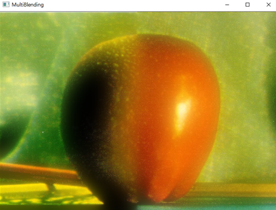

# 2020-2 ComputerVision

## 01 Multiband Blending

**입력 이미지**      

</img> </img>      
          
**마스크**          

</img>    

### 방법 

1. 입력 이미지의 Laplacian Pyramid를 각각 만든다.   
2. Mask의 Gaussian Pyramid를 만든다.   
3. 두 입력이미지의 피라미드의 각 레이어를 Mask에 대해 Alpha Blending을 하고 원상복구한다.      
         
      
### 결과 

</img>   
